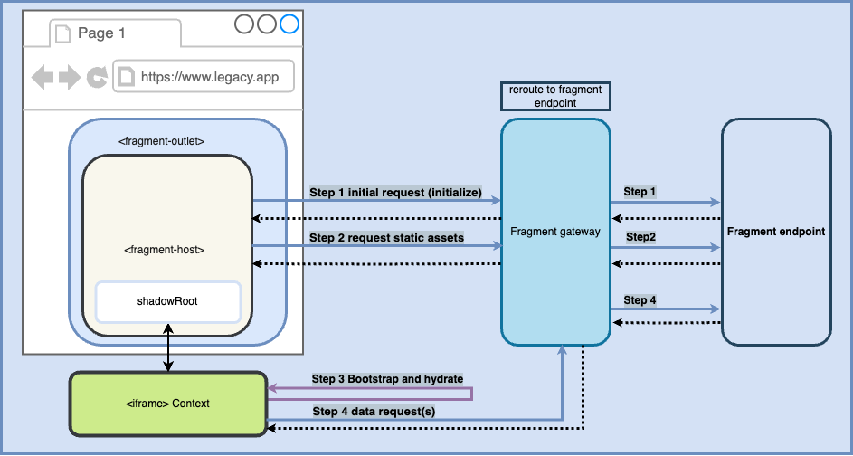

_Last updated_: December 8, 2024

Web Fragments uses `custom elements` as an implementation detail to embed applications in an existing user-interface. By using custom elements we ensure there is only one `Document Object Model` that's walkable and interactive while the `shadowRoot` keeps the styles encapsulated, to prevent `css` pollution and specifity problems.

## Custom elements registration

Before using the `web fragments` custom elements in an application, they must be registered by importing the `register` function provided.

Please notice that different frameworks may require additional utilities to work with `custom elements`. For example `Angular` needs `CUSTOM_ELEMENTS_SCHEMA` to be provided.

```javascript
import { FragmentOutlet } from "./fragment-outlet";
import { FragmentHost } from "./fragment-host";

export function register() {
  window.customElements.define("fragment-outlet", FragmentOutlet);
  window.customElements.define("fragment-host", FragmentHost);
}
```

## Fragment Outlet

In the context of Web Fragments, a `fragment outlet` is a custom element, reponsible for setting up the fragment-id and triggering the Web Fragment gateway and middleware mechanisms. The `fragment outlet` is then used as a placeholder to kick off the [portaling](./glossary#portaling)

```html
<fragment-outlet src="/some-url" fragment-id="some-id"></fragment-outlet>
```

## Fragment Host Client Side

When the application runs and the <fragment-outlet> is parsed it dispatches the 'fragment-outlet-ready' event is triggered and, when not in place a `fragment host` custom element is mounted and nested inside of the `fragment outlet`, taking its `fragment-id`.

From that moment on, the following `reframed` operations take place:

- the [reframing](./glossary#reframing) mechanism gets initialized
- a new iframe context is created and corresponding fragment scripts are portaled and neutralized
- a container with the corresponding [containerTag](./glossary#container-tag) is created
- the [middleware](./middleware) routes all requests intercepted by the server to the application origin upstream
- the corresponding `fragment` is embedded in the container tag, inside of the `fragment-host` shadowRoot



At the same time, an `iframe` will be created in the DOM, to encapsulate all scripts from the remotely fetched application as a fragment.

## Error Handling

The `fragment-outlet` element will dispatch an `fragment-outlet-error` event when the fragment fails to load.
The `fragment-host` element will dispatch an `fragment-host-error` event will fire when there is any type of error during fetching the reframed source.

## Middleware

Middleware in place will be responsible for intercepting all requests coming from the legacy application, identifying those that match with a fragment request, handling scripts and embedding the resulting fragment.

Learn more about [middleware](./middleware) and the Web Fragment mechanisms that port fully working independent applications to be embedded in a functional, legacy shell user interface, in the [middleware](./middleware) section.

---

#### Authors

<ul class="authors">
    <li class="author"><a href="https://github.com/anfibiacreativa">anfibiacreativa</a></li>
    <li class="author"><a href="https://github.com/igorminar">IgorMinar</a></li>
</ul>
